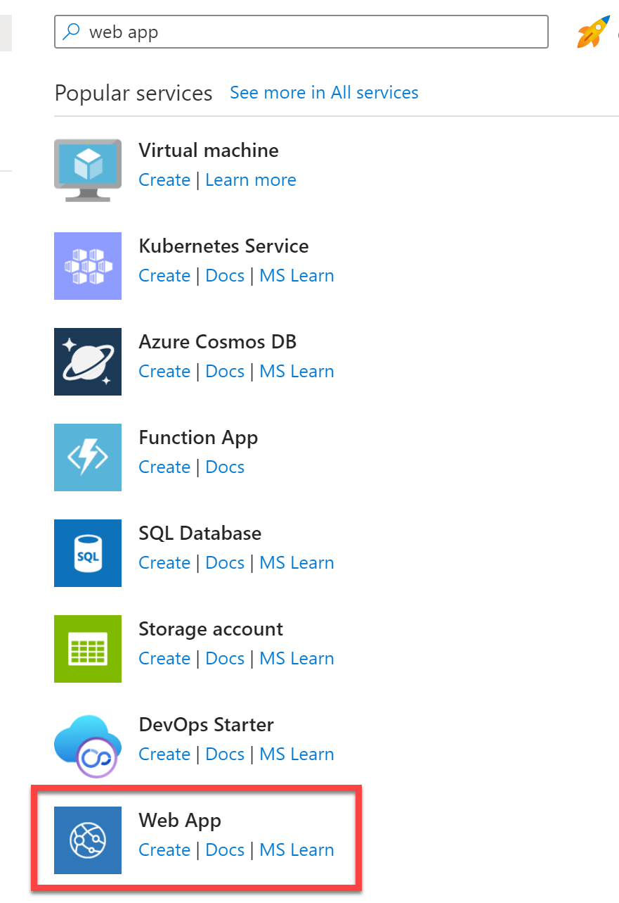
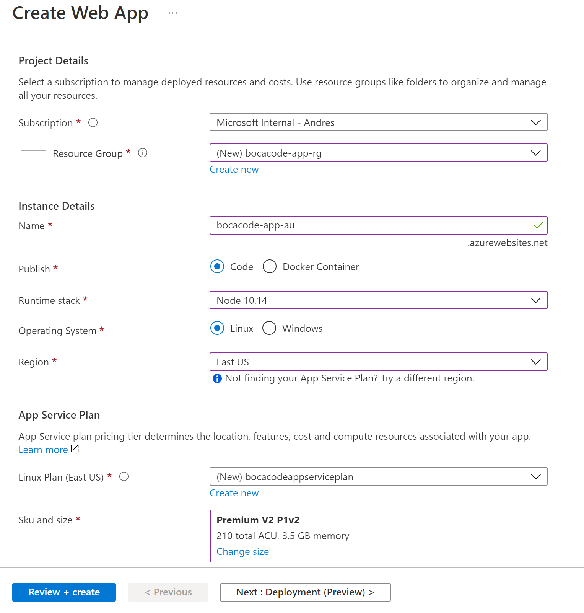
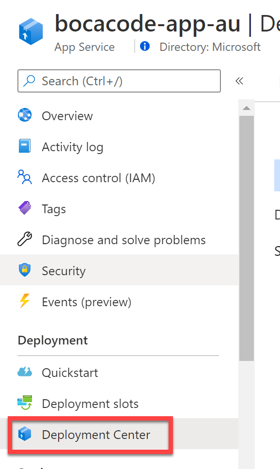
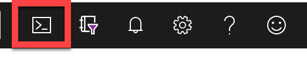
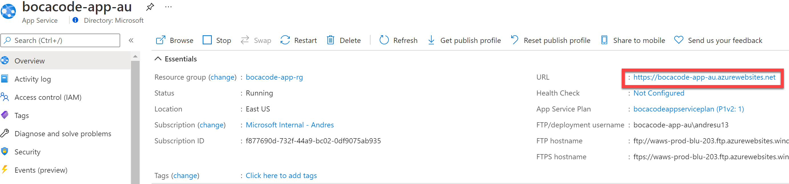
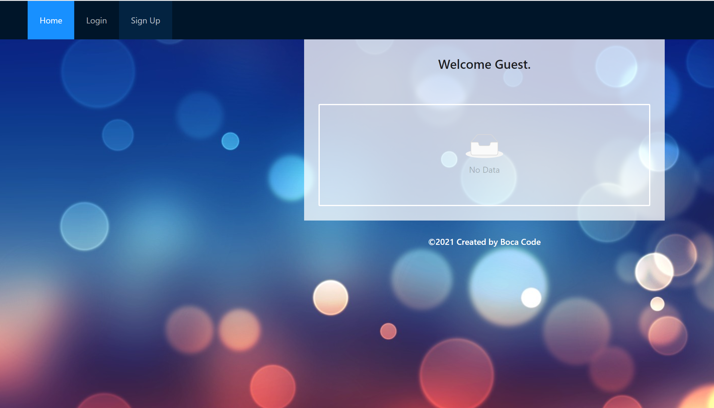

# Azure Fundamentals: NodeJS App Deployment

### Task 1: Create and Configure App Service in the Azure Portal

1. In the [Azure Portal](https://portal.azure.com/), select **+Create a resource** from the left menu, then search for **web app** or find it in the Popular Services menu.

2. Click **Create**.

    

3. Set the following configuration on the Basics tab:

- **Subscription**: (Your Subscription) Select the subscription you are using for this hands-on lab.
- **Resource Group**: Select the **Create new** link, and enter `bocacode-app-rg` as the name of the new resource group.
- **Name**: Enter a globally unique name for your application. Example: bocacode-app-au
- **Publixh**: Select **Code**
- **Runtime Stack**: Select **Node 10.14**
- **Operating System**: Select **Linux**
- **Region**: Select **East US**
- **Linux Plan**: Select **Create New** and enter a unique name for the Service Plan

    

4. Click **Review+Create**

5. Click **Create**

6. Go into the web app resource once it gets deployed and click on **Deployment Center** under the **Deployment** section.

    

7. Click on the **FTPS Credentials** tab and below the **User Scope** section, enter a **Username** and **Password** that will be used to authentiate when deploying the application.

### Task 2: Download Source Code and Push to Web App

1. Open **Azure CloudShell** and make sure you select **Bash** mode.

    

   >**Note**: If this is the first time opening CloudShell, you will get a prompt asking to create a Storage Account. Leave the defaults and select **Create Storage**.

2. Download zip file containing the source code for the Todo Too App

    `wget https://github.com/andresu13/bocacode_webapp/raw/main/todo-app.zip`

3. Unzip the zip archive

    `unzip todo-app.zip -d todo-app`

4. Go inside the todo-app folder

    `cd todo-app`

5. Execute the following commands to create a GIT repository and commit the changes to that repo.
    ```
    git init
    git add -A
    git commit -m "Initial Commit"
    ```

6. Create a connection to the remote app. Make sure you replace **<APP_NAME>** with the name of your application:

    `git remote add azure https://<APP_NAME>.scm.azurewebsites.net/<APP_NAME>.git`

7. Push the code to your Azure Web Application. It will take about 5 minutes for the application to be uploaded and built in Azure.
    
    `git push azure master`

8. Go back to the Web App in the Azure Portal and click on **Overview**. Click on the URL for your application on the top right of that screen:

    

9. A new tab will be opened in your browser that should take you to the app you just deployed:

    

